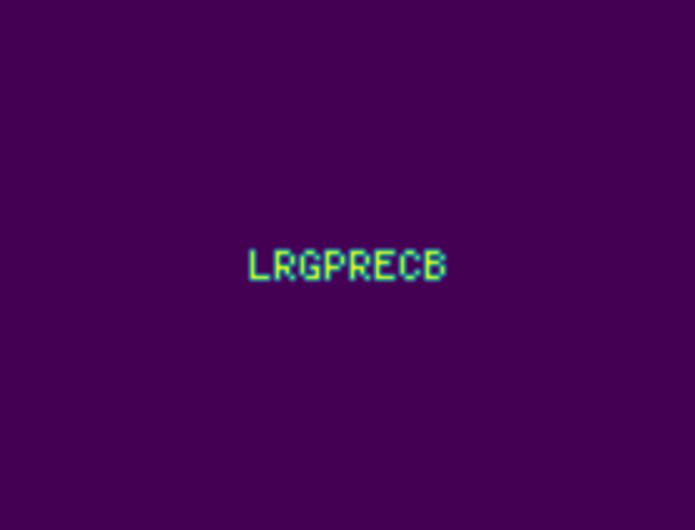

# AoC21

## [--- Day 1: Sonar Sweep ---](http://adventofcode.com/2021/day/1)
We are back! Easy first day. Second part had something to do with
the sum of a sliding window and compare it with the next. The inner elements
are constant, so you only have to compare the one going out of the window, with
the one entering the window.

I challenged my first year students to make this puzzle too in Java.
They haven't got a lot of tools in their toolbox, but they managed to
solve it! Nice work.

## [--- Day 2: Dive! ---](http://adventofcode.com/2021/day/2)
Another easy one, with classic AoC instructions. This time involving a
submarine. Tried to make it generic making a dictionary mapping from 
instruction to function. Probably a lot harder to understand than the
easy solution with some duplicate code. Let's see if this submarine
manual will return in later puzzles!

## [--- Day 3: Binary Diagnostic ---](http://adventofcode.com/2021/day/3)
Needed to refresh some numpy knowledge for this one. Had to use my lunchbreak
to solve the second part, because I didn't have enough time in the morning
before work. Took it quite literally and squeezed in some recursion to shrink
the data matrix without any problems. I guess it was a straightforward puzzle,
without the need to optimize anything. 

But this is mostly the case in the first days and suddenly
the compelxity explodes! For now, I am really happy with the amount of time
I need to invest in the puzzles to solve them. There is enough room to improve
your code if you have the time, but it is not a necessity.

## [--- Day 4: Giant Squid ---](http://adventofcode.com/2021/day/4)
Just had some limited time this weekend to solve the puzzles. In this puzzle
some numpy skills would be very beneficial, but I am not fluent enough with
the module to use it easily and I didn't have stable internet access, so I 
couldn't use it in full advantage. This made it quite a bit harder, but it did work out.

## [--- Day 5: Hydrothermal Venture ---](http://adventofcode.com/2021/day/5)
Puzzle of today: get all points on a line on a grid. Count all overlapping lines
in the grid. Some juggling with y=ax+b. Glad I could finish the puzzles within the
day!

## [--- Day 6: Lanternfish ---](http://adventofcode.com/2021/day/6)
The population of Laternfish is growing * growing. For part two a naive "simulate
every fish in the population"-way wouldn't cut it. So I used "bins" for the 9 types/
ages of the fishes and used a deque as datastructure to handle to needed rotation.
This resulted in a quick execution time and low space requirement.

Also I added a simple workflow to this repository to automatically decorate this
readme file with the correct names of the days and links to the puzzle. Just to get
a python script working in workflow.

## [--- Day 7: The Treachery of Whales ---](http://adventofcode.com/2021/day/7)
Finding a minimum in a search space. Tried to be smart and calculated the median and do
a left/right search for those points and see if it found a better solution. Turned out
the median is already optimal for part 1.
For part 2 I started from the average instead of the median, but didn't no if it would
work for every input, so just rewrote it to brute-force, which is a bit safer maybe and
also less code. And with this size of input it doesn't matter, brute-forcing both parts
are quick and give you the correct answer. So less reason to bother about it..

## [--- Day 8: Seven Segment Search ---](http://adventofcode.com/2021/day/8)
Quite a difficult puzzle to understand at first for me (except for part1). I started trying 
decoding all the segments itself (so: what letter should be on the top line, etc), but got 
some headache to solve it (I guess it is possible this way) and after work looked again and 
found out I didn't need that information to answer the question and it was a lot easier to 
eliminate and just compare the set of letters.

I've seen some very nice and clean solutions, but mine isn't one of them! No time to refactor
or overthink this. 16 stars and counting!

## [--- Day 9: Smoke Basin ---](http://adventofcode.com/2021/day/9)
Classic AoC puzzle: reading in a grid, checking neighbours and do something like a floodfill 
algorithm. Unfortunately I don't have enough time to really elaborate on problems, coding
style, performance and stuff like that like in earlier years. But happy to have some time
to solve the problems.

Note to self: make a library for this kind of stuff, think I coded this 20 times before for AoC.

## [--- Day 10: Syntax Scoring ---](http://adventofcode.com/2021/day/10)
Parse opening and closing symbols! Checking if the given "code" is incorrect and doing some
scoring. Tried to solve it quickly before going to work, but ended up with a bug that
I couldn't fix in time. So had to wait till lunch to get that out of my code. I forgot to
strip the newline characters with reading my file, which I caught in the first part of the
puzzle, but forgot in a letter if-statement. Took a while before I spotted that one.

## [--- Day 11: Dumbo Octopus ---](http://adventofcode.com/2021/day/11)
First kind of Game of Life puzzle of the year! Always fun and made me put some helpers
in my AoC package (reading grid and getting neighbours). Was expecting a harder second
part, but you could still simulate it and get the right answer (at least with my input)

## [--- Day 12: Passage Pathing ---](http://adventofcode.com/2021/day/12)
Today was also straight forward (just use a tree traversal method to get all paths) and
some extra datastructure and conditions to get the second part, but again quick enough
to get the answer for part 2! Usually the weekend puzzles are quite a bit harder, but
this time the first 12 days are all relatively easy. Maybe we will get a very steep curve
next week.. Let's see. I kinda like this small time investment, without too much braindraining
math puzzles.

## [--- Day 13: Transparent Origami ---](http://adventofcode.com/2021/day/13)
Folding a grid, until some characters appear! The pixel characters come back every now and
then in Advent of Code. Some people made patterns for every pixel character and use "pattern"
recognition to solve this automation step. The last time I wanted to use some OCR to automate it.
Something like using a hammer to kill a fly, but seemed fun nevertheless.

So this time I used opencv with pytesseract to do the OCR. Of course this doesn't work out of the
box, because it are really small "pictures" (only 5x5 pixels, but you never know what it will be
next time!). So I upscale the image a lot and add some filter to smooth the edges. This way tesseract
can do its job. Took some fiddling, but validated it with 3 other inputs. 

Fun stuff!

## [--- Day 14: Extended Polymerization ---](http://adventofcode.com/2021/day/14)
A string which grows so quickly, your memory won't survive this one.

Finally a brute-force naïve solution won't cut it for part two. After some minutes observing the output, I couldn't 
figure out a pattern which I could use and needed to come up with a solution the programmers-way. Of course a dictionary 
provided the right datastructure to keep track of the pairs that were present in the string. Just some fiddling with 
counting the letters after it: you should counter the fact that the individual start and end letters are not in two 
pairs, all the other occurences of letters are in two pairs.

## [--- Day 15: Chiton ---](http://adventofcode.com/2021/day/15)

## [--- Day 16: Packet Decoder ---](http://adventofcode.com/2021/day/16)

